# PES-VCS Lab Report

## Student Details
Name: Nishkaa V  
SRN: PES2UG24CS907  
Section: 4B  
GitHub Repository: https://github.com/Nishkaa25/PES2UG24CS907-pes-vcs  

---

## Environment
OS: Linux (Ubuntu VM)  
Compiler: gcc  
Libraries: OpenSSL (libssl-dev)  

---

## Implemented Files
object.c: object_write, object_read  
tree.c: tree_from_index  
index.c: index_load, index_save, index_add  
commit.c: commit_create  

---

## Build and Test Commands Used
make clean
make all
./test_objects
./test_tree
./test_sequence.sh

---

# 📸 Screenshot Evidence

## Phase 1

### 1A — ./test_objects output
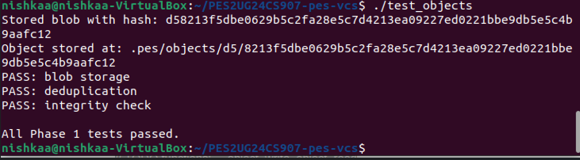

---

### 1B — Object store structure
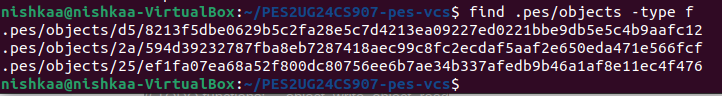

---

## Phase 2

### 2A — ./test_tree output
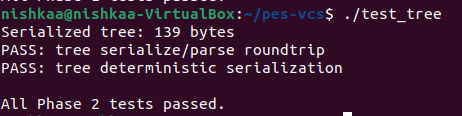

---

### 2B — Raw tree object (hex dump)
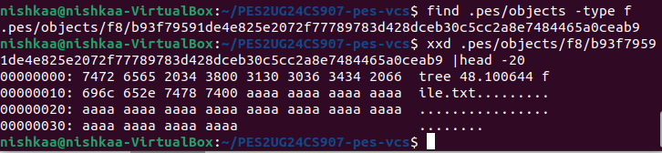

---

## Phase 3

### 3A — pes init → add → status
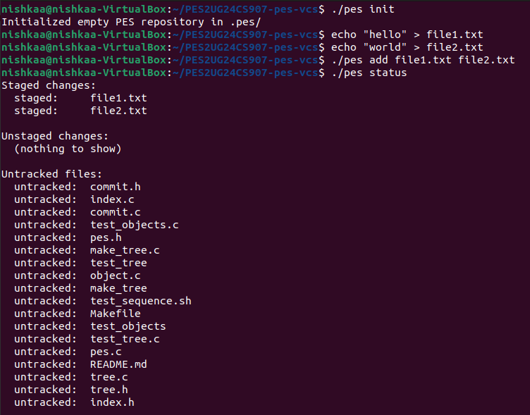

---

### 3B — Index file
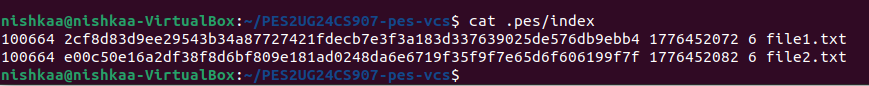

---

## Phase 4

### 4A — Commit log
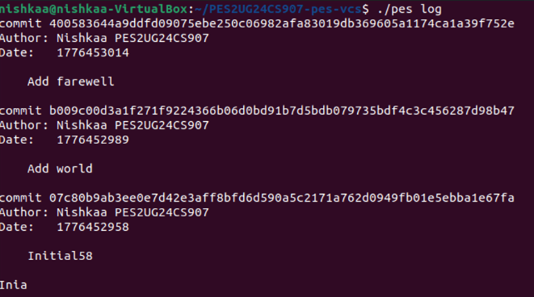

---

### 4B — Object growth
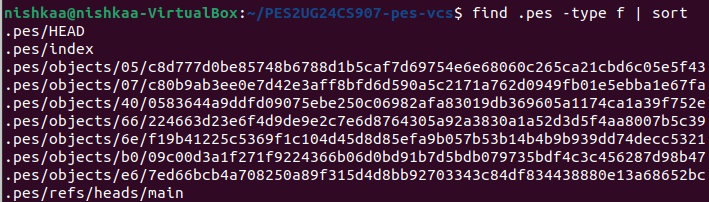

---

### 4C — HEAD and branch reference
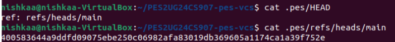

---

## Final Integration Test (test_sequence)

### Full workflow execution

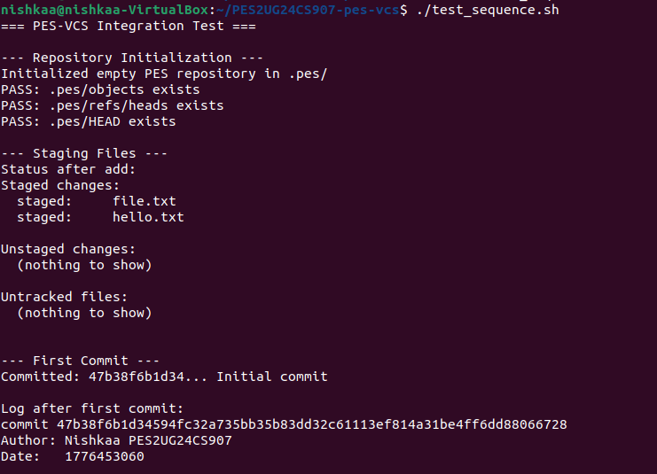  
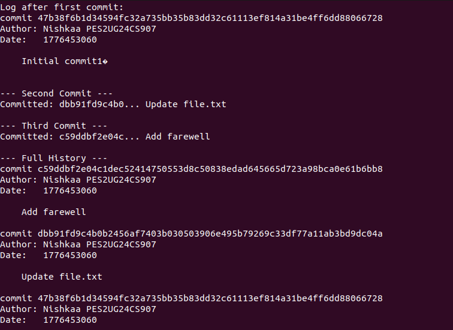  
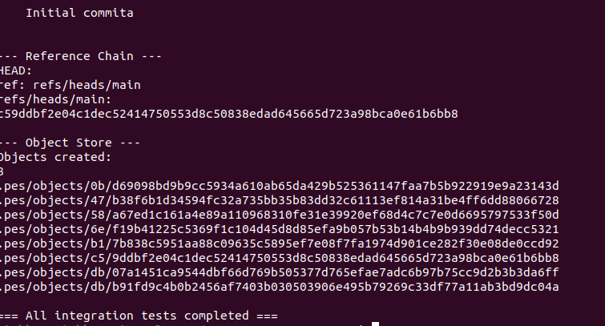

---

# Phase 5 — Analysis Questions

## 1. How would you implement pes checkout <branch>?

To implement `pes checkout <branch>`, the system first checks whether the branch exists in `.pes/refs/heads/`. If found, the HEAD file is updated to point to that branch.

Next, the commit hash stored in that branch is read. Using this commit, the corresponding tree object is obtained. The working directory is updated to match this snapshot by creating files, modifying existing ones, and deleting unnecessary files.

Before checkout, the system must ensure there are no uncommitted changes to prevent data loss.

---

## 2. How to detect a dirty working directory?

A working directory is dirty when it differs from the index.

Detection:
- Compare file size and modification time  
- Missing file → deleted  
- New file → untracked  

For accuracy, recompute and compare file hashes.

---

## 3. What is a Detached HEAD?

Detached HEAD occurs when HEAD points directly to a commit instead of a branch.

Effects:
- New commits are not attached to any branch  
- Can be lost when switching branches  

Recovery:
- Create a new branch at that commit  

---

# Phase 6 — Analysis Questions

## 1. Garbage Collection Algorithm

Garbage collection removes unreachable objects.

Steps:
- Start from branch heads  
- Traverse commits → trees → blobs  
- Mark reachable objects  
- Delete unmarked objects  

---

## 2. Why is GC dangerous during a commit?

During commit:
- objects are created first  
- references are updated later  

If GC runs in between:
- new objects may be deleted  
- leading to corruption  

Solution:
- atomic operations  
- locking  
- delayed GC  

---

# Submission Checklist
- [x] Screenshots included  
- [x] Analysis answers completed  
- [x] Code implemented  
- [x] Repository public  
- [x] Report included  
